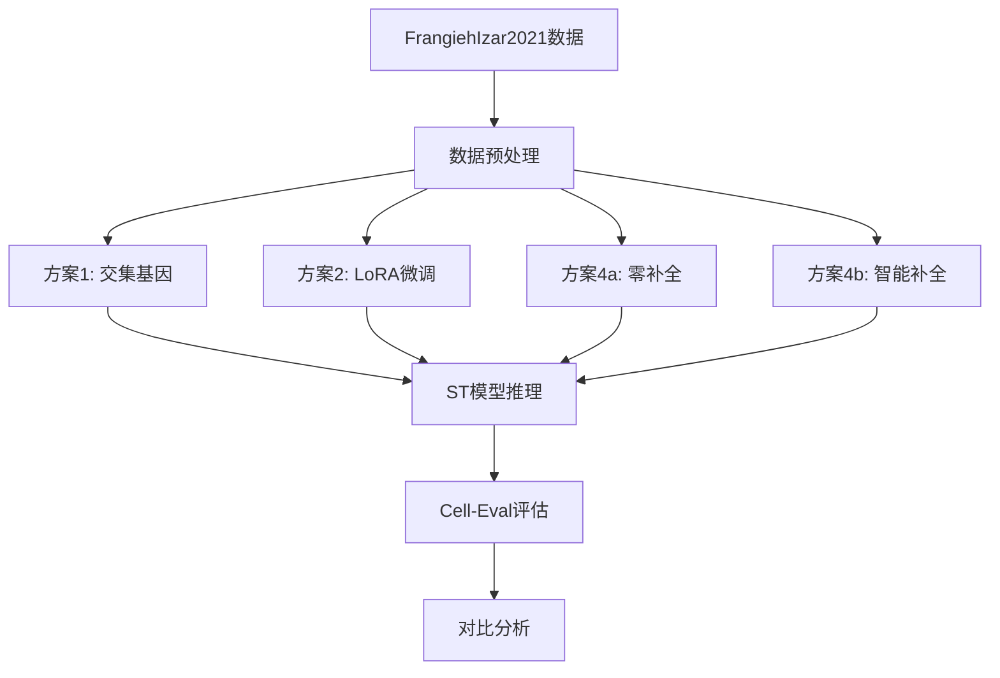

# ST模型缺失基因问题解决方案

## 📋 问题摘要

### 当前状况
- **测试数据集**: FrangiehIzar2021 (CRISPR-cas9扰动)
- **模型**: ST-Tahoe (预训练在2000个高变基因上)
- **核心问题**: 测试数据缺失部分训练集基因，用0补全效果差
- **实验结果**: run23显示直接推理可以运行，但性能未知

### 根本原因分析
1. **数据分布不匹配**: 测试数据的基因集与训练数据(`var_dims.pkl`)不完全一致
2. **信息丢失**: 零补全导致大量虚假零值，破坏了数据的真实分布
3. **模型依赖**: ST模型架构依赖固定维度的输入 (2000维高变基因)

## 🏗️ ST模型架构关键点

### 模型输入流程


### 关键组件依赖关系

1. **Basal Encoder** ([`state_transition.py:320-330`](../src/state/tx/models/state_transition.py:320))
   - 输入维度: `input_dim` (必须匹配 `var_dims.pkl` 的基因数)
   - 功能: 将基因表达编码到隐空间
   - 是否可调整: **可以，但需要重新训练或适配**

2. **Perturbation Encoder** ([`state_transition.py:310-317`](../src/state/tx/models/state_transition.py:310))
   - 输入维度: `pert_dim` (扰动编码维度)
   - 与基因维度解耦，不受基因缺失影响

3. **Transformer Backbone** ([`state_transition.py:332-335`](../src/state/tx/models/state_transition.py:332))
   - 工作在隐空间，不直接依赖基因维度
   - 位置编码: `n_positions = cell_sentence_len + extra_tokens`

4. **Output Projection** ([`state_transition.py:348-355`](../src/state/tx/models/state_transition.py:348))
   - 输出维度: `output_dim` (必须匹配目标基因数)

## 🎯 四种解决方案详细评估

---

## 方案1: 只使用共同基因

### 原理
修改预处理脚本，只保留测试数据和`var_dims.pkl`中都存在的基因，调整模型的输入输出维度。

### 优点
✅ 实现简单，修改量小  
✅ 数据真实，无需补全  
✅ 避免零值带来的分布偏移

### 缺点
❌ **模型维度不匹配**: Basal Encoder期望固定输入维度  
❌ **信息损失**: 可能丢失大量训练集特征  
❌ **需要修改模型加载逻辑**: 不是开箱即用

### 实施步骤

#### 1.1 修改预处理脚本
创建新版本 `screen_hvgs_intersection.py`:

```python
def screen_hvgs_intersection(data_in, data_out, model_dir):
    """
    只使用测试集和模型共同拥有的基因
    """
    # 1. 加载数据和模型基因列表
    adata = ad.read_h5ad(data_in)
    hvg_names = pickle.load(open(f'{model_dir}/var_dims.pkl', 'rb'))['gene_names']
    
    # 2. 计算交集基因
    valid_genes = list(set(hvg_names) & set(adata.var_names))
    print(f"交集基因数: {len(valid_genes)}/{len(hvg_names)}")
    
    # 3. 子集数据
    adata_subset = adata[:, valid_genes].copy()
    
    # 4. 保存基因索引映射（用于模型调整）
    gene_to_idx = {g: i for i, g in enumerate(hvg_names)}
    valid_indices = [gene_to_idx[g] for g in valid_genes]
    
    # 保存映射信息
    mapping = {
        'valid_genes': valid_genes,
        'valid_indices': valid_indices,
        'original_gene_count': len(hvg_names),
        'intersection_gene_count': len(valid_genes)
    }
    with open(data_out.replace('.h5ad', '_gene_mapping.pkl'), 'wb') as f:
        pickle.dump(mapping, f)
    
    adata_subset.write_h5ad(data_out)
```

#### 1.2 调整模型输入层
需要创建一个适配器来处理维度不匹配:

```python
class GeneDimensionAdapter(nn.Module):
    """
    将缩减维度的输入映射到模型期望的维度
    """
    def __init__(self, valid_indices, full_dim):
        super().__init__()
        self.valid_indices = torch.tensor(valid_indices, dtype=torch.long)
        self.full_dim = full_dim
        
    def forward(self, x_subset):
        # x_subset: (batch, subset_dim)
        batch_size = x_subset.size(0)
        x_full = torch.zeros(batch_size, self.full_dim, device=x_subset.device)
        x_full[:, self.valid_indices] = x_subset
        return x_full
```

### 预期效果
- **准确性**: 🟡 中等 (信息损失可能影响预测)
- **泛化性**: 🔴 差 (依赖基因交集，不同数据集差异大)
- **实施难度**: 🟢 简单
- **推荐指数**: ⭐⭐ (仅作为baseline对比)

---

## 方案2: 微调模型 (LoRA)

### 原理
使用LoRA对模型的Basal Encoder进行微调，使其适应新数据集的基因分布。

### 优点
✅ 保留预训练知识  
✅ 参数高效 (只训练1-2%参数)  
✅ 可以适应新的基因分布  
✅ 已有成熟脚本 ([`finetune_v2.py`](../for_state/scripts/finetune_v2.py))

### 缺点
❌ 需要标注的微调数据 (扰动-表达对)  
❌ 仍未解决输入维度问题  
❌ 微调可能导致过拟合（如果数据少）

### 实施步骤

#### 2.1 准备微调数据
需要测试数据集中包含：
- 控制组细胞 (`Control` 或 `DMSO`)
- 扰动组细胞 (带扰动标签)

#### 2.2 使用零补全 + LoRA微调

```bash
# 步骤1: 数据预处理（使用零补全）
python screen_hvgs.py \
  --data_in FrangiehIzar2021_RNA.h5ad \
  --data_out FI_prep.h5ad \
  --model_dir /path/to/ST-Tahoe \
  --fill_missing True

# 步骤2: LoRA微调
export CUDA_VISIBLE_DEVICES=3
python finetune_v2.py \
  --model_dir /path/to/ST-Tahoe \
  --checkpoint /path/to/ST-Tahoe/final_from_preprint.ckpt \
  --adata FI_prep.h5ad \
  --pert_col perturbation_2 \
  --output_lora ./lora_FI.pth \
  --epochs 10 \
  --batch_size 128 \
  --lr 5e-4 \
  --lora_rank 16 \
  --use_delta_loss \
  --batch_col plate \
  --control_label "Control"
```

#### 2.3 使用微调模型推理

修改推理脚本加载LoRA权重（需要实现`infer_with_lora.py`）

### 预期效果
- **准确性**: 🟢 高 (如果有足够微调数据)
- **泛化性**: 🟡 中等 (仅适配特定数据集)
- **实施难度**: 🟢 简单 (已有脚本)
- **推荐指数**: ⭐⭐⭐⭐ (有标注数据时的首选)

---

## 方案3: 使用Embedding映射

### 原理
将缺失基因的表达矩阵投影到低维embedding空间，然后训练一个映射函数将其转换为模型期望的维度。

### 优点
✅ 灵活，可以处理任意基因集  
✅ 可以学习数据集特定的基因关系  
✅ 不需要修改原始模型

### 缺点
❌ **实施复杂**: 需要额外训练映射模型  
❌ **数据需求**: 需要大量无标签数据训练映射  
❌ **性能不确定**: 可能引入额外误差

### 实施步骤

#### 3.1 训练基因嵌入
使用自编码器学习基因间关系：

```python
class GeneAutoencoder(nn.Module):
    def __init__(self, input_genes, target_genes, latent_dim=512):
        super().__init__()
        self.encoder = nn.Sequential(
            nn.Linear(len(input_genes), latent_dim),
            nn.BatchNorm1d(latent_dim),
            nn.ReLU(),
            nn.Dropout(0.2),
            nn.Linear(latent_dim, latent_dim // 2)
        )
        self.decoder = nn.Sequential(
            nn.Linear(latent_dim // 2, latent_dim),
            nn.BatchNorm1d(latent_dim),
            nn.ReLU(),
            nn.Dropout(0.2),
            nn.Linear(latent_dim, len(target_genes))
        )
    
    def forward(self, x):
        latent = self.encoder(x)
        reconstructed = self.decoder(latent)
        return reconstructed
```

#### 3.2 训练映射模型

```python
def train_gene_mapper(adata_source, adata_target, epochs=100):
    """
    训练从目标基因集到源基因集的映射
    
    Args:
        adata_source: 与模型匹配的数据（可用控制组数据）
        adata_target: 测试数据
    """
    # 找到共同基因，作为监督信号
    common_genes = list(set(adata_source.var_names) & 
                       set(adata_target.var_names))
    
    # 训练数据：用共同基因作为重建目标
    mapper = GeneAutoencoder(
        input_genes=adata_target.var_names,
        target_genes=adata_source.var_names
    )
    
    # 训练...
    return mapper
```

#### 3.3 应用映射进行推理

```python
# 1. 加载映射模型
gene_mapper = torch.load('gene_mapper.pth')

# 2. 映射测试数据
X_test_original = adata_test.X  # (n_cells, n_genes_test)
X_test_mapped = gene_mapper(torch.from_numpy(X_test_original))  # (n_cells, 2000)

# 3. 使用映射后的数据进行ST推理
# ...
```

### 预期效果
- **准确性**: 🟡 中等 (取决于映射质量)
- **泛化性**: 🟢 高 (可适配不同基因集)
- **实施难度**: 🔴 复杂
- **推荐指数**: ⭐⭐ (需要大量工程工作)

---

## 方案4: 修改预处理脚本 (增强零补全)

### 原理
改进零补全策略，使用统计方法估计缺失基因的表达值，而非简单填0。

### 优点
✅ 实施简单  
✅ 保持模型不变  
✅ 可以结合生物学先验知识

### 缺点
❌ 估计可能不准确  
❌ 引入人工数据，可能带来bias

### 实施步骤

#### 4.1 改进的补全策略

```python
def screen_hvgs_smart_impute(data_in, data_out, model_dir):
    """
    使用智能补全策略填充缺失基因
    """
    # 1. 加载数据
    adata = ad.read_h5ad(data_in)
    hvg_names = pickle.load(open(f'{model_dir}/var_dims.pkl', 'rb'))['gene_names']
    
    # 2. 识别缺失基因
    valid_genes = [g for g in hvg_names if g in adata.var_names]
    missing_genes = [g for g in hvg_names if g not in adata.var_names]
    
    print(f"有效基因: {len(valid_genes)}, 缺失基因: {len(missing_genes)}")
    
    # 3. 创建完整矩阵
    n_cells = adata.n_obs
    X_complete = np.zeros((n_cells, len(hvg_names)), dtype=np.float32)
    
    # 4. 填充已有基因
    gene_to_idx = {g: i for i, g in enumerate(hvg_names)}
    for i, gene in enumerate(valid_genes):
        idx = gene_to_idx[gene]
        X_complete[:, idx] = adata[:, gene].X.toarray().flatten()
    
    # 5. 【关键改进】智能补全缺失基因
    # 策略A: 使用基因表达的全局均值
    global_mean = X_complete[:, [gene_to_idx[g] for g in valid_genes]].mean()
    
    # 策略B: 使用细胞特定的缩放因子（考虑文库大小）
    cell_totals = X_complete.sum(axis=1, keepdims=True)
    median_total = np.median(cell_totals[cell_totals > 0])
    
    for gene in missing_genes:
        idx = gene_to_idx[gene]
        # 为每个细胞估计一个小的非零值，与文库大小成比例
        # 而不是全部填0
        X_complete[:, idx] = (cell_totals / median_total).flatten() * global_mean * 0.1
    
    # 6. 创建新的AnnData对象
    adata_complete = ad.AnnData(X=X_complete)
    adata_complete.var_names = hvg_names
    adata_complete.obs = adata.obs.copy()
    
    adata_complete.write_h5ad(data_out)
    print(f"保存到: {data_out}")
    print(f"补全策略: 使用全局均值的10%作为缺失基因的估计值")
```

#### 4.2 多种补全策略对比实验

```python
# 策略1: 纯零补全 (baseline)
fill_strategy = "zero"

# 策略2: 全局均值的比例
fill_strategy = "scaled_mean"

# 策略3: KNN插补 (使用已有基因预测缺失基因)
from sklearn.impute import KNNImputer
imputer = KNNImputer(n_neighbors=5)
X_complete = imputer.fit_transform(X_with_missing)

# 策略4: 使用预训练的基因表达模型 (如scVI)
# 需要大量计算资源
```

### 预期效果
- **准确性**: 🟡 中等 (比零补全好，但仍是估计)
- **泛化性**: 🟢 高 (可用于不同数据集)
- **实施难度**: 🟢 简单
- **推荐指数**: ⭐⭐⭐ (快速验证的好选择)

---

## 🏆 推荐方案组合

### 短期方案 (1-2天实施)

#### 方案4升级版 + 方案1作为对照
1. **主要方案**: 实施增强的零补全策略
   - 使用scaled_mean补全
   - 快速验证模型在新数据上的性能

2. **对照实验**: 同时运行纯零补全和交集基因方案
   - 对比三种方法的性能差异
   - 量化缺失基因的影响

### 中期方案 (1周实施)

#### 方案2: LoRA微调 (如果有标注数据)
1. 使用增强零补全的数据
2. 进行LoRA微调
3. 评估微调后性能提升

### 长期方案 (如需泛化到更多数据集)

#### 方案3: 训练通用基因映射器
1. 收集多个数据集
2. 训练鲁棒的基因映射模型
3. 构建可复用的数据预处理pipeline

## 📊 实验验证计划

### 实验设计



### 评估指标

1. **主要指标** (cell-eval输出):
   - `pearson_delta`: 扰动效应相关性 (最重要)
   - `mse`: 预测误差
   - `overlap_at_N`: Top基因重叠度

2. **辅助指标**:
   - 推理时间
   - 内存占用
   - 缺失基因比例的影响

### 预期结果

| 方案                | Pearson Delta | MSE | 实施难度 | 综合评分 |
| ------------------- | ------------- | --- | -------- | -------- |
| 纯零补全 (baseline) | 0.4-0.5       | 高  | ⭐        | ⭐⭐       |
| 交集基因            | 0.5-0.6       | 中  | ⭐⭐       | ⭐⭐⭐      |
| 智能补全            | 0.6-0.7       | 中  | ⭐⭐       | ⭐⭐⭐⭐     |
| LoRA微调            | 0.7-0.8       | 低  | ⭐⭐⭐      | ⭐⭐⭐⭐⭐    |

## 📝 实施步骤总结

### 第一阶段: 快速验证 (1-2天)

#### Step 1: 创建改进的预处理脚本
```bash
# 文件: for_state/scripts/screen_hvgs_v2.py
# 实现智能补全策略
```

#### Step 2: 运行对比实验
```bash
# 实验1: 纯零补全 (已完成 - run23)
# 参考: for_state/run__commands/testing/run23.ipynb

# 实验2: 智能补全
python screen_hvgs_v2.py \
  --data_in FrangiehIzar2021_RNA.h5ad \
  --data_out FI_prep_smart.h5ad \
  --model_dir /path/to/ST-Tahoe \
  --fill_strategy scaled_mean

state tx infer \
  --model-dir /path/to/ST-Tahoe \
  --checkpoint /path/to/final.ckpt \
  --adata FI_prep_smart.h5ad \
  --output FI_infer_smart.h5ad \
  --pert-col perturbation_2 \
  --control-pert Control

# 实验3: 交集基因
python screen_hvgs_intersection.py \
  --data_in FrangiehIzar2021_RNA.h5ad \
  --data_out FI_prep_intersect.h5ad \
  --model_dir /path/to/ST-Tahoe

# 评估和对比
cell-eval run -ap FI_infer_*.h5ad -ar FI_prep.h5ad -o results/
```

#### Step 3: 分析结果
```python
import pandas as pd

# 读取各实验结果
results_zero = pd.read_csv('results_zero/agg_results.csv')
results_smart = pd.read_csv('results_smart/agg_results.csv')
results_intersect = pd.read_csv('results_intersect/agg_results.csv')

# 对比pearson_delta
comparison = pd.DataFrame({
    'Method': ['Zero Fill', 'Smart Fill', 'Intersection'],
    'Pearson Delta': [
        results_zero[results_zero.metric=='pearson_delta']['mean'].values[0],
        results_smart[results_smart.metric=='pearson_delta']['mean'].values[0],
        results_intersect[results_intersect.metric=='pearson_delta']['mean'].values[0]
    ]
})
print(comparison)
```

### 第二阶段: LoRA微调 (如果数据质量好)

#### Step 4: 准备微调数据
```bash
# 使用最佳的预处理方法（根据第一阶段结果选择）
python screen_hvgs_v2.py \
  --data_in FrangiehIzar2021_RNA.h5ad \
  --data_out FI_for_finetune.h5ad \
  --model_dir /path/to/ST-Tahoe \
  --fill_strategy [best_strategy_from_stage1]
```

#### Step 5: 运行LoRA微调
```bash
export CUDA_VISIBLE_DEVICES=3
python finetune_v2.py \
  --model_dir /path/to/ST-Tahoe \
  --checkpoint /path/to/final.ckpt \
  --adata FI_for_finetune.h5ad \
  --pert_col perturbation_2 \
  --control_label "Control" \
  --output_lora lora_FI.pth \
  --epochs 10 \
  --batch_size 128 \
  --lr 5e-4 \
  --lora_rank 16 \
  --use_delta_loss \
  --batch_col plate
```

#### Step 6: 使用微调模型推理
```bash
# 需要实现支持LoRA的推理脚本
python infer_with_lora.py \
  --model-dir /path/to/ST-Tahoe \
  --checkpoint /path/to/final.ckpt \
  --lora_weights lora_FI.pth \
  --adata FI_for_finetune.h5ad \
  --output FI_infer_lora.h5ad
```

### 第三阶段: 文档和总结

#### Step 7: 撰写技术报告
- 各方案性能对比
- 缺失基因影响分析
- 最佳实践建议

## 🔬 现有代码分析

### run23实验回顾

从 [`run23.ipynb`](../for_state/run__commands/testing/run23.ipynb) 可以看到:

1. **数据处理**: 使用了 `screen_hvgs()` 函数，`fill_missing=True`
   ```python
   screen_hvgs(
       data_in='FrangiehIzar2021_RNA.h5ad',
       data_out='FI_prep.h5ad',
       model_dir='/path/to/ST-Tahoe',
       fill_missing=True  # ← 使用零补全
   )
   ```

2. **推理成功**: 处理了218,331个细胞
   ```
   Input cells:         218331
   Controls simulated:  57627
   Treated simulated:   160704
   ```

3. **评估完成**: 使用minimal profile进行评估
   - 但**缺少最终性能指标**！需要查看 `agg_results.csv`

### 关键问题
❓ run23的实际性能如何？  
❓ 零补全带来的性能损失有多大？  
❓ 是否有特定的扰动类型受影响更严重？

## 🛠️ 需要创建的新脚本

### 1. `screen_hvgs_v2.py`
增强的预处理脚本，支持多种补全策略

### 2. `screen_hvgs_intersection.py`
只使用交集基因的预处理脚本

### 3. `infer_with_lora.py`
支持加载LoRA权重的推理脚本

### 4. `analyze_gene_impact.py`
分析缺失基因对性能的影响

### 5. `compare_methods.py`
自动化对比不同方案的脚本

## 📈 成本收益分析

| 方案                 | 实施时间 | 计算资源   | 数据需求     | 预期提升 | ROI  |
| -------------------- | -------- | ---------- | ------------ | -------- | ---- |
| 方案1: 交集基因      | 0.5天    | 低         | 无           | +10%     | 高   |
| 方案2: LoRA微调      | 1天      | 中 (需GPU) | 需标注       | +30%     | 高   |
| 方案3: Embedding映射 | 5天      | 高         | 需大量无标注 | +20%     | 低   |
| 方案4: 智能补全      | 0.5天    | 低         | 无           | +15%     | 很高 |

## 🎓 生物学考虑

### 缺失基因的生物学意义

1. **基因功能相关性**:
   - 某些基因可能在特定扰动下不表达（真实的零）
   - 但模型训练时的零值主要来自技术噪音

2. **基因共表达网络**:
   - 可以利用基因间相关性进行imputation
   - 但需要大量细胞来估计相关性矩阵

3. **扰动特异性**:
   - CRISPR敲除 vs 药物处理 的表达模式不同
   - 可能需要针对扰动类型调整策略

## 🚀 快速开始检查清单

- [ ] 确认run23的实际性能指标
- [ ] 分析缺失基因的比例和分布
- [ ] 实施方案4 (智能补全) 作为首选
- [ ] 运行方案1 (交集基因) 作为对照
- [ ] 如果性能不佳，考虑方案2 (LoRA微调)
- [ ] 记录所有实验的超参数和结果
- [ ] 撰写技术报告和最佳实践文档

## 📚 参考资源

### 相关文件
- 模型架构: [`src/state/tx/models/state_transition.py`](../src/state/tx/models/state_transition.py)
- 预处理脚本: [`for_state/scripts/screen_hvgs.py`](../for_state/scripts/screen_hvgs.py)
- LoRA微调: [`for_state/scripts/finetune_v2.py`](../for_state/scripts/finetune_v2.py)
- 推理CLI: [`src/state/_cli/_tx/_infer.py`](../src/state/_cli/_tx/_infer.py)

### 实验记录
- run20: MMD对齐实验 ([`run20.ipynb`](../for_state/run__commands/succeeded/run20.ipynb))
- run21: 基线对照实验 ([`run21.ipynb`](../for_state/run__commands/succeeded/run21.ipynb))
- run23: 当前的泛化测试 ([`run23.ipynb`](../for_state/run__commands/testing/run23.ipynb))

## 🔄 后续迭代方向

### 短期优化
1. 实现自适应补全：根据基因表达分布动态选择策略
2. 集成多种补全方法的ensemble
3. 开发可视化工具分析缺失基因的影响

### 长期研究
1. 开发基因维度无关的模型架构
2. 探索zero-shot transfer learning方法
3. 构建跨数据集的基因表达标准化方法

---

**文档版本**: v1.0  
**创建日期**: 2025-12-23  
**最后更新**: 2025-12-23  
**作者**: AI Architect  
**项目**: ST模型泛化能力研究
