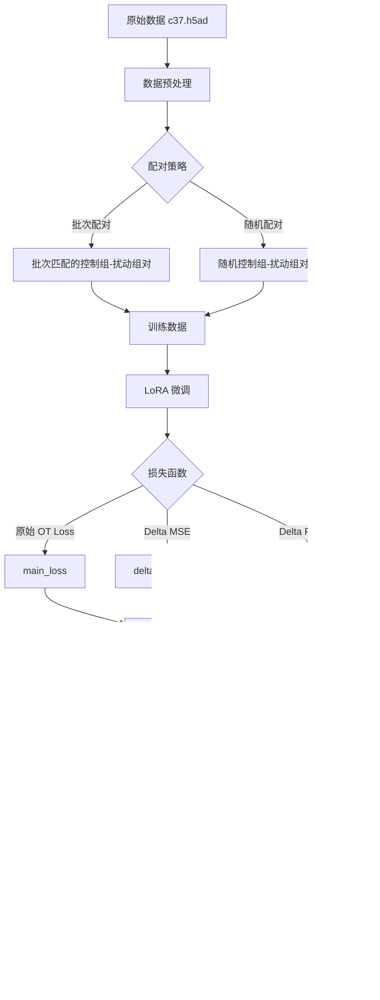

# 药物扰动预测优化设计方案

## 目标：提升 pearson_delta 指标

---

## 1. 问题分析总结

### 1.1 当前实验结果
- LoRA 微调后 MSE/MAE 显著下降（好）
- **pearson_delta 下降了 13.47%**（从 0.4428 降至 0.3832）- 这是核心问题

### 1.2 pearson_delta 指标理解

根据 [`pearson_delta()`](state/.venv/lib/python3.11/site-packages/cell_eval/metrics/_anndata.py:24) 的实现：

```python
def pearson_delta(data: PerturbationAnndataPair, embed_key: str | None = None) -> dict[str, float]:
    """Compute Pearson correlation between mean differences from control."""
    return _generic_evaluation(data, pearsonr, use_delta=True, embed_key=embed_key)
```

关键点：
- 计算的是**扰动效应（delta）**的 Pearson 相关性
- `delta = perturbation_effect(which="pred/real")` = 扰动后均值 - 控制组均值
- **不是直接比较预测值和真实值，而是比较预测的"变化量"和真实的"变化量"**

### 1.3 基因敲除 vs 药物扰动的关键差异

| 特性     | 基因敲除       | 药物扰动                           |
| -------- | -------------- | ---------------------------------- |
| 扰动类型 | 离散、二元     | 连续（不同浓度）                   |
| 作用机制 | 单基因靶点明确 | 多通路、多靶点                     |
| 效应强度 | 相对固定       | 剂量依赖                           |
| 数据分布 | 方差较小       | 方差大，同一药物不同浓度效应差异大 |

### 1.4 现有代码的核心问题

#### 问题 1：数据配对策略不适合药物扰动

[`AnnDataPerturbationDataset.__getitem__()`](state/for_state/scripts/finetune.py:190):
```python
# 随机选择控制组细胞 - 问题所在！
ctrl_idx = np.random.choice(self.ctrl_indices)
```

**问题**：随机配对忽略了批次效应、细胞类型等混杂因素。

#### 问题 2：损失函数未直接优化 delta

[`StateTransitionPerturbationModel.training_step()`](state/src/state/tx/models/state_transition.py:500):
```python
# 直接比较 pred 和 target，而不是 delta
main_loss = self.loss_fn(pred, target).nanmean()
```

**问题**：损失函数优化的是绝对表达值，而不是扰动效应。

#### 问题 3：推断时使用扰动后细胞自身的表达作为输入

[`infer_lora.py`](state/for_state/scripts/infer_lora.py:299):
```python
# 问题：使用扰动后细胞的表达作为输入
X_batch = torch.tensor(X[start_idx:end_idx], dtype=torch.float32).to(device)
```

**问题**：评估时应该使用控制组表达作为输入，才能正确评估模型预测扰动效应的能力。

---

## 2. 优化方案设计

### 2.1 数据配对策略优化

#### 方案 A：基于批次的配对（推荐）

```python
class AnnDataPerturbationDatasetV2(Dataset):
    """改进的数据集类，支持基于批次的智能配对"""
    
    def __init__(self, adata, pert_onehot_map: Dict[str, torch.Tensor], 
                 pert_col: str = "drugname_drugconc",
                 control_label: str = "[('DMSO_TF', 0.0, 'uM')]",
                 batch_col: str = None,           # 新增：批次列
                 celltype_col: str = None,        # 新增：细胞类型列
                 pairing_strategy: str = "batch"  # 新增：配对策略
                ):
        """
        Args:
            pairing_strategy: 
                - "random": 随机配对（原始行为）
                - "batch": 同批次配对
                - "celltype": 同细胞类型配对
                - "batch_celltype": 同批次+同细胞类型配对
        """
        self.adata = adata
        self.pert_col = pert_col
        self.control_label = control_label
        self.batch_col = batch_col
        self.celltype_col = celltype_col
        self.pairing_strategy = pairing_strategy
        
        # 构建配对索引映射
        self._build_pairing_index()
    
    def _build_pairing_index(self):
        """构建控制组细胞的分组索引，用于智能配对"""
        pert_names = self.adata.obs[self.pert_col].values
        
        # 识别控制组和扰动组
        self.ctrl_mask = pert_names == self.control_label
        self.pert_mask = pert_names != self.control_label
        
        self.ctrl_indices = np.where(self.ctrl_mask)[0]
        self.pert_indices = np.where(self.pert_mask)[0]
        
        if self.pairing_strategy == "random":
            self.ctrl_groups = None
            return
        
        # 构建分组索引
        self.ctrl_groups = {}
        
        for idx in self.ctrl_indices:
            group_key = self._get_group_key(idx)
            if group_key not in self.ctrl_groups:
                self.ctrl_groups[group_key] = []
            self.ctrl_groups[group_key].append(idx)
        
        # 转换为 numpy 数组以加速采样
        for key in self.ctrl_groups:
            self.ctrl_groups[key] = np.array(self.ctrl_groups[key])
    
    def _get_group_key(self, idx):
        """获取细胞的分组键"""
        keys = []
        if self.pairing_strategy in ["batch", "batch_celltype"]:
            if self.batch_col and self.batch_col in self.adata.obs:
                keys.append(str(self.adata.obs[self.batch_col].iloc[idx]))
        if self.pairing_strategy in ["celltype", "batch_celltype"]:
            if self.celltype_col and self.celltype_col in self.adata.obs:
                keys.append(str(self.adata.obs[self.celltype_col].iloc[idx]))
        return tuple(keys) if keys else ("default",)
    
    def _get_paired_ctrl_idx(self, pert_idx):
        """为扰动组细胞获取配对的控制组细胞索引"""
        if self.pairing_strategy == "random" or self.ctrl_groups is None:
            return np.random.choice(self.ctrl_indices)
        
        group_key = self._get_group_key(pert_idx)
        
        if group_key in self.ctrl_groups and len(self.ctrl_groups[group_key]) > 0:
            return np.random.choice(self.ctrl_groups[group_key])
        else:
            # 回退到随机采样
            return np.random.choice(self.ctrl_indices)
    
    def __getitem__(self, idx):
        pert_idx = self.pert_indices[idx]
        ctrl_idx = self._get_paired_ctrl_idx(pert_idx)
        
        # ... 其余逻辑保持不变
```

#### 方案 B：控制组均值配对

```python
class AnnDataPerturbationDatasetMean(Dataset):
    """使用控制组均值作为输入的数据集"""
    
    def __init__(self, adata, pert_onehot_map, pert_col, control_label,
                 use_ctrl_mean: bool = True,      # 是否使用控制组均值
                 batch_col: str = None):
        # ...
        
        if use_ctrl_mean:
            self._compute_ctrl_means()
    
    def _compute_ctrl_means(self):
        """预计算分组控制组均值"""
        ctrl_data = self.adata[self.ctrl_mask]
        
        if self.batch_col:
            # 按批次计算控制组均值
            self.ctrl_means = {}
            for batch in ctrl_data.obs[self.batch_col].unique():
                batch_mask = ctrl_data.obs[self.batch_col] == batch
                self.ctrl_means[batch] = np.mean(ctrl_data[batch_mask].X, axis=0)
        else:
            # 全局控制组均值
            self.ctrl_mean = np.mean(ctrl_data.X, axis=0)
    
    def __getitem__(self, idx):
        pert_idx = self.pert_indices[idx]
        
        # 使用对应批次的控制组均值
        if self.batch_col and hasattr(self, 'ctrl_means'):
            batch = self.adata.obs[self.batch_col].iloc[pert_idx]
            ctrl_emb = torch.tensor(self.ctrl_means[batch], dtype=torch.float32)
        else:
            ctrl_emb = torch.tensor(self.ctrl_mean, dtype=torch.float32)
        
        # ...
```

---

### 2.2 Delta-Aware 损失函数设计

#### 方案 A：直接优化 Delta 的 Pearson 相关性（推荐）

```python
class DeltaAwareLoss(nn.Module):
    """
    直接优化扰动效应(delta)的损失函数
    
    核心思想：
    - delta_pred = pred - ctrl
    - delta_true = target - ctrl  
    - 优化 delta_pred 和 delta_true 之间的相关性
    """
    
    def __init__(self, 
                 base_loss_weight: float = 1.0,    # 原始损失权重
                 delta_mse_weight: float = 1.0,    # Delta MSE权重
                 delta_pearson_weight: float = 0.5, # Delta Pearson相关性权重
                 eps: float = 1e-8):
        super().__init__()
        self.base_loss_weight = base_loss_weight
        self.delta_mse_weight = delta_mse_weight
        self.delta_pearson_weight = delta_pearson_weight
        self.eps = eps
        self.mse_loss = nn.MSELoss()
    
    def pearson_correlation_loss(self, pred, target):
        """
        计算 Pearson 相关性损失
        返回 1 - correlation，使得最小化损失等价于最大化相关性
        """
        # 展平为 [batch, features]
        pred_flat = pred.reshape(pred.size(0), -1)
        target_flat = target.reshape(target.size(0), -1)
        
        # 中心化
        pred_centered = pred_flat - pred_flat.mean(dim=1, keepdim=True)
        target_centered = target_flat - target_flat.mean(dim=1, keepdim=True)
        
        # 计算相关性
        numerator = (pred_centered * target_centered).sum(dim=1)
        pred_std = torch.sqrt((pred_centered ** 2).sum(dim=1) + self.eps)
        target_std = torch.sqrt((target_centered ** 2).sum(dim=1) + self.eps)
        
        correlation = numerator / (pred_std * target_std + self.eps)
        
        # 返回 1 - mean(correlation) 作为损失
        return 1 - correlation.mean()
    
    def forward(self, pred, target, ctrl, base_loss=None):
        """
        Args:
            pred: 预测的扰动后表达 [B, S, D]
            target: 真实的扰动后表达 [B, S, D]
            ctrl: 控制组表达 [B, S, D]
            base_loss: 原始损失（如 OT loss）
        """
        # 计算 delta
        delta_pred = pred - ctrl
        delta_true = target - ctrl
        
        total_loss = 0.0
        
        # 1. 原始损失（如 OT loss）
        if base_loss is not None and self.base_loss_weight > 0:
            total_loss = total_loss + self.base_loss_weight * base_loss
        
        # 2. Delta MSE 损失
        if self.delta_mse_weight > 0:
            delta_mse = self.mse_loss(delta_pred, delta_true)
            total_loss = total_loss + self.delta_mse_weight * delta_mse
        
        # 3. Delta Pearson 相关性损失
        if self.delta_pearson_weight > 0:
            delta_pearson_loss = self.pearson_correlation_loss(delta_pred, delta_true)
            total_loss = total_loss + self.delta_pearson_weight * delta_pearson_loss
        
        return total_loss
```

#### 方案 B：集成到 `training_step` 中

```python
def training_step_with_delta_loss(self, batch: Dict[str, torch.Tensor], 
                                   batch_idx: int, padded=True) -> torch.Tensor:
    """改进的训练步骤，加入 delta-aware 损失"""
    
    # 获取预测
    pred = self.forward(batch, padded=padded)
    target = batch["pert_cell_emb"]
    ctrl = batch["ctrl_cell_emb"]
    
    if padded:
        pred = pred.reshape(-1, self.cell_sentence_len, self.output_dim)
        target = target.reshape(-1, self.cell_sentence_len, self.output_dim)
        ctrl = ctrl.reshape(-1, self.cell_sentence_len, self.output_dim)
    else:
        pred = pred.reshape(1, -1, self.output_dim)
        target = target.reshape(1, -1, self.output_dim)
        ctrl = ctrl.reshape(1, -1, self.output_dim)
    
    # 1. 原始 OT 损失
    main_loss = self.loss_fn(pred, target).nanmean()
    
    # 2. Delta MSE 损失（新增）
    delta_pred = pred - ctrl
    delta_true = target - ctrl
    delta_mse_loss = F.mse_loss(delta_pred, delta_true)
    
    # 3. Delta Pearson 损失（新增）
    delta_pearson_loss = self._compute_pearson_loss(delta_pred, delta_true)
    
    # 加权组合
    total_loss = (
        self.hparams.get("base_loss_weight", 1.0) * main_loss +
        self.hparams.get("delta_mse_weight", 0.5) * delta_mse_loss +
        self.hparams.get("delta_pearson_weight", 0.3) * delta_pearson_loss
    )
    
    # 日志记录
    self.log("train/main_loss", main_loss)
    self.log("train/delta_mse_loss", delta_mse_loss)
    self.log("train/delta_pearson_loss", delta_pearson_loss)
    self.log("train_loss", total_loss)
    
    return total_loss

def _compute_pearson_loss(self, pred, target, eps=1e-8):
    """计算 Pearson 相关性损失"""
    # 按批次计算
    B, S, D = pred.shape
    pred_flat = pred.reshape(B, -1)  # [B, S*D]
    target_flat = target.reshape(B, -1)
    
    # 中心化
    pred_centered = pred_flat - pred_flat.mean(dim=1, keepdim=True)
    target_centered = target_flat - target_flat.mean(dim=1, keepdim=True)
    
    # Pearson 相关系数
    numerator = (pred_centered * target_centered).sum(dim=1)
    pred_var = (pred_centered ** 2).sum(dim=1)
    target_var = (target_centered ** 2).sum(dim=1)
    
    correlation = numerator / (torch.sqrt(pred_var * target_var) + eps)
    
    # 返回 1 - mean_correlation 作为损失
    return 1 - correlation.mean()
```

---

### 2.3 LoRA 应用范围扩展

#### 当前状态

[`finetune.py`](state/for_state/scripts/finetune.py:469) 中仅对 `transformer_backbone` 应用 LoRA：

```python
model, lora_modules = replace_linear_with_lora(model, r=args.lora_rank, alpha=args.lora_alpha,
                                               target_module_keywords=target_keywords)
```

#### 方案：扩展到 pert_encoder 和 basal_encoder

```python
def apply_lora_to_encoders(model, lora_rank, lora_alpha):
    """
    对 pert_encoder 和 basal_encoder 应用 LoRA
    
    背景：对于药物扰动，药物编码可能需要适配新的药物-细胞相互作用模式
    """
    lora_modules = {}
    
    # 1. 对 transformer_backbone 应用 LoRA（原有逻辑）
    model, backbone_lora = replace_linear_with_lora(
        model, r=lora_rank, alpha=lora_alpha,
        target_module_keywords=["transformer_backbone", "attn", "mlp"]
    )
    lora_modules.update(backbone_lora)
    
    # 2. 对 pert_encoder 应用 LoRA（新增 - 重要！）
    # 药物扰动可能需要不同的编码方式
    model, pert_lora = replace_linear_with_lora(
        model.pert_encoder, r=lora_rank, alpha=lora_alpha
    )
    for name, module in pert_lora.items():
        lora_modules[f"pert_encoder.{name}"] = module
    
    # 3. 可选：对 basal_encoder 应用较小 rank 的 LoRA
    # 基础表达编码通常变化不大
    model, basal_lora = replace_linear_with_lora(
        model.basal_encoder, r=lora_rank // 2, alpha=lora_alpha / 2
    )
    for name, module in basal_lora.items():
        lora_modules[f"basal_encoder.{name}"] = module
    
    return model, lora_modules
```

#### 推荐的 LoRA 应用策略

| 模块                 | 是否应用 LoRA | Rank | Alpha | 原因                   |
| -------------------- | ------------- | ---- | ----- | ---------------------- |
| transformer_backbone | ✅ 是          | 8    | 1.0   | 核心预测模块           |
| pert_encoder         | ✅ 是（推荐）  | 8    | 1.0   | 药物编码需要适配新数据 |
| basal_encoder        | ⚠️ 可选        | 4    | 0.5   | 基础表达编码变化较小   |
| project_out          | ❌ 否          | -    | -     | 输出投影层保持不变     |

---

### 2.4 推断流程改进

#### 核心问题

当前推断使用扰动后细胞的表达作为输入：
```python
X_batch = torch.tensor(X[start_idx:end_idx], dtype=torch.float32)
```

这是**错误的**！评估 pearson_delta 时，应该：
1. 使用控制组表达作为输入
2. 让模型预测扰动后的表达
3. 计算预测的 delta 和真实的 delta 的相关性

#### 改进方案

```python
def run_tx_infer_v2(args):
    """改进的推断流程，正确处理药物扰动评估"""
    
    # ... 模型加载代码保持不变 ...
    
    # 关键改进：使用控制组均值作为输入
    logger.info("Computing control group mean expression...")
    ctrl_mask = adata.obs[args.pert_col] == control_pert
    ctrl_data = adata[ctrl_mask]
    
    if args.embed_key in ctrl_data.obsm:
        ctrl_X = ctrl_data.obsm[args.embed_key]
    else:
        ctrl_X = ctrl_data.X.toarray() if hasattr(ctrl_data.X, 'toarray') else ctrl_data.X
    
    # 计算全局控制组均值，或按批次计算
    if args.batch_col and args.batch_col in adata.obs:
        ctrl_means = {}
        for batch in ctrl_data.obs[args.batch_col].unique():
            batch_mask = ctrl_data.obs[args.batch_col] == batch
            ctrl_means[batch] = np.mean(ctrl_X[batch_mask], axis=0)
        logger.info(f"Computed control means for {len(ctrl_means)} batches")
    else:
        ctrl_mean = np.mean(ctrl_X, axis=0)
        ctrl_means = None
        logger.info("Computed global control mean")
    
    # 只对扰动组细胞进行推断
    pert_mask = adata.obs[args.pert_col] != control_pert
    adata_pert = adata[pert_mask].copy()
    
    all_preds = []
    n_samples = adata_pert.n_obs
    
    with torch.no_grad():
        for batch_idx in range(0, n_samples, batch_size):
            start_idx = batch_idx
            end_idx = min(start_idx + batch_size, n_samples)
            current_batch_size = end_idx - start_idx
            
            # 获取这批细胞的控制组输入
            if ctrl_means is not None:
                # 按批次获取对应的控制组均值
                batch_labels = adata_pert.obs[args.batch_col].iloc[start_idx:end_idx].values
                ctrl_batch = np.stack([ctrl_means.get(b, ctrl_mean) for b in batch_labels])
            else:
                # 使用全局控制组均值
                ctrl_batch = np.tile(ctrl_mean, (current_batch_size, 1))
            
            X_batch = torch.tensor(ctrl_batch, dtype=torch.float32).to(device)
            
            # 获取扰动编码
            pert_batch = pert_tensor[start_idx:end_idx].to(device)
            
            # ... 填充和推断逻辑 ...
            
            batch = {
                "ctrl_cell_emb": X_batch,  # 使用控制组表达！
                "pert_emb": pert_batch,
                "pert_name": pert_names_batch,
                "batch": torch.zeros((1, cell_sentence_len), device=device),
            }
            
            batch_preds = model.predict_step(batch, batch_idx=batch_idx, padded=False)
            # ...
    
    # 输出包含预测的扰动后表达
    adata_pert.layers["predicted"] = np.concatenate(all_preds, axis=0)
    adata_pert.write_h5ad(output_path)
```

---

### 2.5 数据增强与正则化

#### 方案 A：药物浓度感知的增强

```python
class DrugConcentrationAugmentation:
    """
    药物浓度感知的数据增强
    
    思路：同一药物不同浓度产生的效应是连续的，可以进行插值增强
    """
    
    def __init__(self, adata, pert_col, drug_col="drug_name", conc_col="concentration"):
        self.adata = adata
        self.pert_col = pert_col
        self.drug_col = drug_col
        self.conc_col = conc_col
        self._build_drug_concentration_map()
    
    def _build_drug_concentration_map(self):
        """构建药物-浓度-细胞映射"""
        self.drug_conc_cells = {}
        for drug in self.adata.obs[self.drug_col].unique():
            drug_data = self.adata[self.adata.obs[self.drug_col] == drug]
            concentrations = sorted(drug_data.obs[self.conc_col].unique())
            self.drug_conc_cells[drug] = {
                conc: np.where(
                    (self.adata.obs[self.drug_col] == drug) & 
                    (self.adata.obs[self.conc_col] == conc)
                )[0]
                for conc in concentrations
            }
    
    def interpolate_concentration(self, drug, target_conc):
        """
        为目标浓度生成插值的细胞表达
        """
        if drug not in self.drug_conc_cells:
            return None
        
        concs = sorted(self.drug_conc_cells[drug].keys())
        
        # 找到相邻的浓度
        lower_conc = max([c for c in concs if c <= target_conc], default=concs[0])
        upper_conc = min([c for c in concs if c >= target_conc], default=concs[-1])
        
        if lower_conc == upper_conc:
            # 直接返回该浓度的数据
            return self.adata.X[self.drug_conc_cells[drug][lower_conc]]
        
        # 线性插值
        alpha = (target_conc - lower_conc) / (upper_conc - lower_conc)
        lower_expr = self.adata.X[self.drug_conc_cells[drug][lower_conc]].mean(axis=0)
        upper_expr = self.adata.X[self.drug_conc_cells[drug][upper_conc]].mean(axis=0)
        
        return (1 - alpha) * lower_expr + alpha * upper_expr
```

#### 方案 B：药物过拟合正则化

```python
def add_drug_diversity_regularization(self, pred, target, pert_names, ctrl):
    """
    防止模型对特定药物过拟合的正则化
    
    思路：鼓励模型预测更多样化的药物效应，而不是趋向于某种"平均效应"
    """
    # 按药物分组计算预测的 delta
    unique_drugs = set(pert_names)
    drug_deltas = {}
    
    for drug in unique_drugs:
        drug_mask = [name == drug for name in pert_names]
        if sum(drug_mask) > 0:
            drug_pred = pred[drug_mask]
            drug_ctrl = ctrl[drug_mask]
            drug_deltas[drug] = (drug_pred - drug_ctrl).mean(dim=0)
    
    if len(drug_deltas) < 2:
        return 0.0
    
    # 计算药物间 delta 的方差 - 鼓励多样性
    drug_delta_tensor = torch.stack(list(drug_deltas.values()))
    diversity = drug_delta_tensor.var(dim=0).mean()
    
    # 返回负的方差作为正则化项（最大化方差 = 最小化负方差）
    return -0.1 * diversity
```

---

## 3. 推荐的实验配置

### 3.1 第一阶段：数据配对优化

```bash
python finetune.py \
    --model_dir /path/to/model \
    --adata /path/to/c37.h5ad \
    --pert_col drugname_drugconc \
    --pairing_strategy batch \       # 新增：使用批次配对
    --batch_col batch \              # 新增：指定批次列
    --epochs 5 \
    --batch_size 128 \
    --lr 5e-4 \
    --lora_rank 8
```

### 3.2 第二阶段：Delta-Aware 损失

```bash
python finetune.py \
    --model_dir /path/to/model \
    --adata /path/to/c37.h5ad \
    --pert_col drugname_drugconc \
    --pairing_strategy batch \
    --use_delta_loss \               # 新增：启用 delta 损失
    --delta_mse_weight 0.5 \         # 新增：delta MSE 权重
    --delta_pearson_weight 0.3 \     # 新增：delta Pearson 权重
    --base_loss_weight 1.0 \
    --epochs 10 \
    --lr 3e-4
```

### 3.3 第三阶段：扩展 LoRA

```bash
python finetune.py \
    --model_dir /path/to/model \
    --adata /path/to/c37.h5ad \
    --pert_col drugname_drugconc \
    --pairing_strategy batch \
    --use_delta_loss \
    --lora_target_modules transformer_backbone,pert_encoder \  # 新增：扩展 LoRA
    --lora_rank 8 \
    --epochs 10 \
    --lr 3e-4
```

### 3.4 推荐的超参数搜索范围

| 参数                   | 搜索范围    | 说明               |
| ---------------------- | ----------- | ------------------ |
| `lr`                   | 1e-4 ~ 1e-3 | 学习率             |
| `lora_rank`            | 4, 8, 16    | LoRA 秩            |
| `delta_mse_weight`     | 0.1 ~ 1.0   | Delta MSE 权重     |
| `delta_pearson_weight` | 0.1 ~ 0.5   | Delta Pearson 权重 |
| `base_loss_weight`     | 0.5 ~ 1.0   | 原始损失权重       |

---

## 4. 实现优先级

| 优先级 | 改进项                         | 预期收益         | 实现难度 |
| ------ | ------------------------------ | ---------------- | -------- |
| 🔴 高   | 推断流程修正（使用控制组均值） | 直接修复评估逻辑 | 低       |
| 🔴 高   | 数据配对策略优化（批次配对）   | 减少混杂因素     | 中       |
| 🟡 中   | Delta-Aware 损失函数           | 直接优化目标指标 | 中       |
| 🟡 中   | LoRA 扩展到 pert_encoder       | 提升药物适配能力 | 低       |
| 🟢 低   | 药物浓度增强                   | 数据增强         | 高       |

---

## 5. 工作流程图



---

## 6. 文件修改清单

### 6.1 [`finetune.py`](state/for_state/scripts/finetune.py) 修改

1. **Line 132-186**: 重写 `AnnDataPerturbationDataset` 类
   - 添加 `pairing_strategy` 参数
   - 实现 `_build_pairing_index()` 方法
   - 实现 `_get_paired_ctrl_idx()` 方法

2. **Line 274-373**: 修改 `train_lora()` 函数
   - 添加 `DeltaAwareLoss` 支持
   - 添加 delta 损失的日志记录

3. **Line 469-476**: 扩展 LoRA 应用范围
   - 支持 `--lora_target_modules` 参数
   - 默认包含 `pert_encoder`

### 6.2 [`infer_lora.py`](state/for_state/scripts/infer_lora.py) 修改

1. **Line 219-250**: 修改数据加载逻辑
   - 分离控制组和扰动组
   - 计算控制组均值

2. **Line 293-340**: 重写推断循环
   - 使用控制组均值作为输入
   - 正确处理批次信息

### 6.3 新增文件

- `state/for_state/scripts/losses/delta_aware_loss.py`: Delta-Aware 损失函数实现
- `state/for_state/scripts/datasets/drug_perturbation_dataset.py`: 改进的数据集类

---

## 7. 总结

本设计方案针对药物扰动预测任务，从以下四个关键方面进行优化：

1. **数据配对策略**：从随机配对改为基于批次/细胞类型的智能配对，减少混杂因素
2. **损失函数**：引入 Delta-Aware 损失，直接优化扰动效应的相关性
3. **LoRA 应用范围**：扩展到 `pert_encoder`，提升药物编码的适配能力
4. **推断流程**：修正为使用控制组均值作为输入，与评估指标的计算方式保持一致

预期通过这些改进，pearson_delta 指标能够恢复甚至超过原始模型的水平（0.4428+）。
